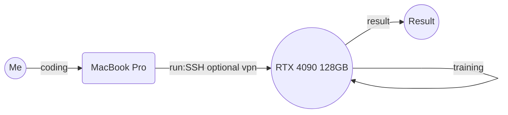

# Deep Learning Study with RTX 4090 :fire::fire::fire::fire::fire::fire::fire::fire::fire::fire::fire::fire::fire::fire::fire::fire::fire::fire::fire::fire:

## Introduction

---
>혹시 제가 작성한 코드 및 내용을 사용하실 때는 각 서적을 사서 직접 하시기 바랍니다... 왜 나만 사야하나요?
---
>또한, 이 코드는 제가 직접 작성한 것이 아니라, 각 서적의 예제 코드를 참고하여 작성한 것입니다. 따라서, 이 코드를 사용하여 발생하는 모든 문제에 대해 책임지지 않습니다.

## Goal

퇴사

## Topics

* GANs In Action
* 머신러닝교과서-파이토치
* 밑바닥부터 시작하는 딥러닝 1
* 밑바닥부터 시작하는 딥러닝 2
* 밑바닥부터 시작하는 딥러닝 3
* 밑바닥부터 시작하는 딥러닝 4
* 밑바닥부터 시작하는 딥러닝 5 (4월 25일 출판 예정: 일본)
* 트랜스포머를 활용한 자연어 처리
* 파이토치 심층학습
* 直感 Deep Learning ...

## Members

* Me
* RTX 4090
* 코드 전송용 맥북 프로
* 족발

## Warning

* 일본어로 된 서적으로 공부한 내용은 한국어로 번역하지 않습니다.
* 영어로된 서적으로는 공부하지 않습니다.

## Installation

... 영업 비밀 입니다.

## Usage

적어도 RTX 4090이상이 있어야 속이 편하다.

## License

내 허깅페이스 토큰 훔쳐가면 뭐할건데?

## 勉強の環境

## Features

* [x] RTX 4090 128GB (중고차 급, 족발대자 100개급)
* [ ] RTX 4090 x2 128GB (아반떼랑 지피유를 바꾼격임, 족발대자 230개급)
* [ ] RTX 4090 x4 128GB (비현실적인 목표) (억지부리면 소나타급이 될 수도 있음, 족발로 치환 불가능)
* [ ] LLama 2 챗봇 만들어보기
* [ ] LangChain 써보기 (챗지피티는 연동 안할꺼임:money_mouth_face:)
* [ ] 블로그에 쓸만한 글 쓰기 (아주 비 현설적인 목표)
* [ ] 논문 읽기 (아주 많이 읽어야함)

## Learning Curve

